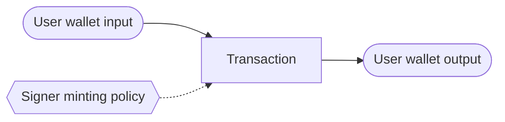
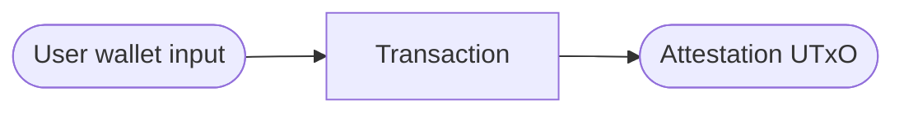
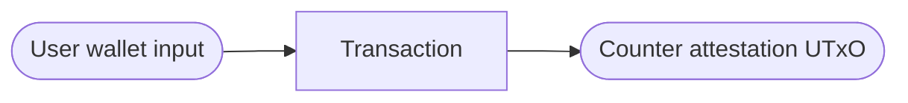
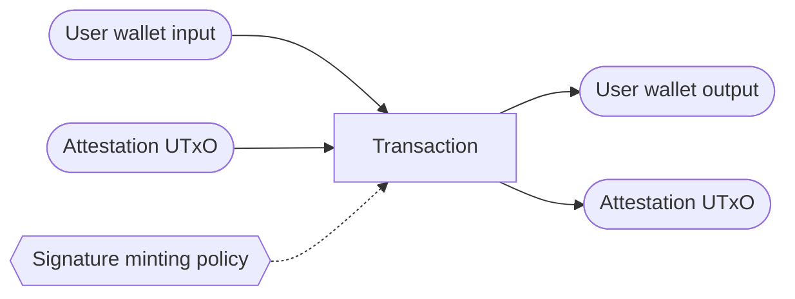
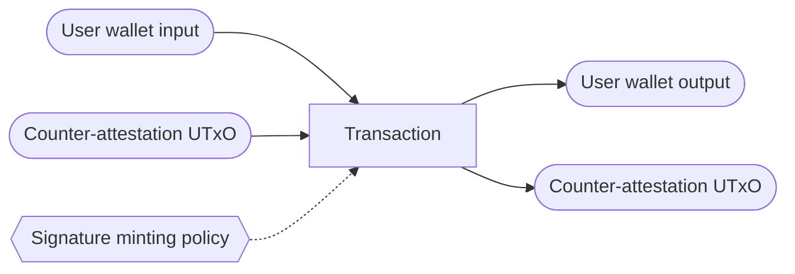

# Transactions

## Create signer token

Purpose: a user wants to be able to mint his signing tokens to attest to
contracts.

Notes:
- The minted unique token is sent to the wallet of the user.

## Create attestation

Purpose: the contract developer wants signers to validate that compiling the
code results in the given script hash, address, policy id and/or staking key.

Note:
- The Attestation UTxO is not validated, it should not be signed if it is
  incorrect.

## Create counter-attestation

Purpose: a signer finds that an attestation is wrong, he creates a
counter-attestation to describe the discrepancies he found.

Notes:
- The counter-attestation must reference an original script hash.

## Signing an attestation

Puprose: a signer verified that the values in an attestation are correct and
wants to add his signature token to it.

Notes:
- A signer token must be spent.
- The minted signature token is put into the value of the Attestation UTxO, it's
  token name identifies the original signer token.
- The datum is validated here: only a valid UTxO can be signed.

## Signing a counter-attestation

Puprose: a signer verified that the values in a counter-attestation are correct
and wants to add his signature token to it.

Notes:
- A signer token must be spent.
- The minted signature token is put into the value of the counter-attestation UTxO, it's
  token name identifies the original signer token.
- The datum is validated here: only a valid UTxO can be signed.
